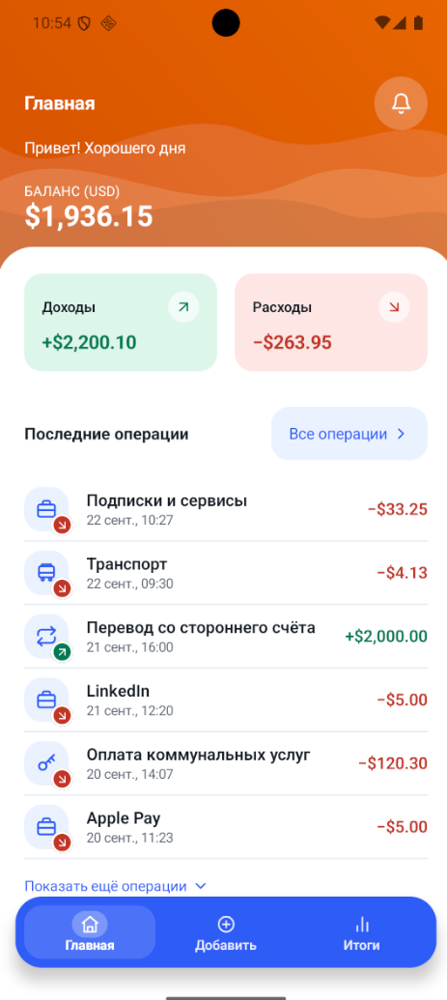
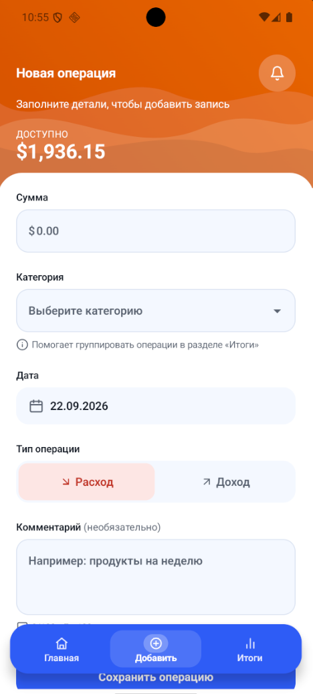
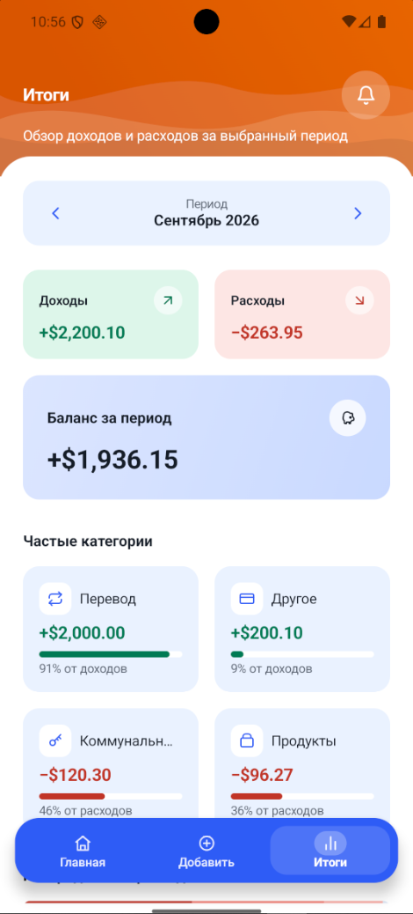

# Fintrack - учебный проект, приложение для учёта личных расходов.
Сервис помогает пользователям фиксировать доходы и траты, распределять их по категориям, отслеживать динамику бюджета и видеть наглядную статистику - по расходам за разные периоды. Цель проекта — дать простой и удобный инструмент для контроля личных финансов без лишней сложности.

Программы в которых осуществляется проект - Figma, Vs Code, Claude Code. 

Вспомогательные программы - Claude, ChatGPT, Canva.

---


Компактное нативное Android-приложение для учёта личных доходов и расходов.
Работает полностью офлайн: все данные лежат в локальной базе Room на устройстве.

Приложение собрано по HTML-макету: перенесены палитра, отступы, радиусы,
типографика и композиция экранов, а веб-специфичные паттерны заменены на
нативные Android-аналоги.

## Экраны

| Главная | Новая операция | Итоги |
|---|---|---|
|  |  |  |

| Экран | Что показывает |
|---|---|
| **Главная** | Общий баланс, доходы и расходы за текущий месяц, последние операции, переход к полному списку |
| **Все операции** | Полный список с группировкой по дням («Сегодня», «Вчера», дата) |
| **Новая операция** | Сумма, категория, дата, тип (доход/расход), комментарий, проверка заполнения и сохранение |
| **Итоги** | Выбор месяца, доходы/расходы/баланс за период, частые категории, распределение расходов, последние операции |

## Что умеет версия 1.0

- Записывать доходы и расходы: сумма, категория, дата, тип и комментарий
- Считать общий баланс, а также доходы и расходы за текущий месяц
- Показывать последние операции и полный список с разбивкой по дням
- Подводить итоги за любой месяц: доходы, расходы и баланс за период
- Показывать самые частые категории с долями и распределение расходов
- Проверять заполнение формы и не давать сохранить некорректную запись
- Работать полностью без интернета — все записи хранятся на самом телефоне
- Сразу после установки показывать 7 готовых категорий и примеры операций
- Подстраиваться под размер экрана, поворот и увеличенный системный шрифт
- Переключаться на тёмное оформление вслед за настройкой телефона

## Чего пока не умеет

- Изменять и удалять уже сохранённые операции
- Добавлять свои категории — доступны только семь готовых
- Считать итоги за произвольный отрезок времени: период только календарный месяц
- Работать с другими валютами — все суммы в долларах
- Выгружать записи в файл или переносить их на другой телефон вручную
- Синхронизироваться между устройствами: аккаунта и облака нет
- Напоминать о расходах и присылать уведомления — колокольчик в шапке пока
  только сообщает, что уведомлений нет
- Планировать бюджет и следить за лимитами по категориям

План разработки, разбор макета и решения по архитектуре — в [docs/PLAN.md](docs/PLAN.md).

## Как установить на телефон

Приложения нет в Google Play, поэтому оно ставится файлом. Программистом быть
не нужно, всё делается с самого телефона за пару минут.

1. Откройте **на телефоне** страницу с выпусками:
   **[github.com/KapDaniel/Fintrack/releases](https://github.com/KapDaniel/Fintrack/releases)**
2. В самом верхнем выпуске найдите файл **`fintrack-1.0.apk`** и нажмите на него.
   Файл начнёт скачиваться.
3. Откройте скачанный файл: опустите шторку уведомлений и нажмите на
   загрузку, либо зайдите в приложение «Файлы» → «Загрузки».
4. Телефон предупредит, что установка приложений из этого источника запрещена,
   и предложит перейти в настройки. Нажмите **«Настройки»** и включите там
   разрешение, затем вернитесь кнопкой «Назад».
5. Нажмите **«Установить»**, дождитесь окончания и нажмите **«Открыть»**.

Готово — приложением можно пользоваться. При первом запуске в нём уже будет
несколько примеров операций, чтобы было видно, как всё работает.

**Что стоит знать заранее**

- Нужен Android 12 или новее.
- Файл весит около 3 МБ, скачивается за секунды.
- Интернет и регистрация не нужны вообще.
- Телефон может написать, что приложение от неизвестного разработчика. Это
  нормально для программ, которые ставят не из магазина.
- Все записи хранятся только на вашем телефоне и никуда не отправляются.
  Если удалить приложение, записи удалятся вместе с ним.

**Если ставите новую версию поверх старой:** просто установите новый файл,
удалять предыдущую не нужно — записи сохранятся.

---

Дальше — техническая часть для тех, кто будет собирать проект сам.

## Требования

| Компонент | Версия |
|---|---|
| JDK | 17 |
| Android Studio | актуальный стабильный релиз (проект собирался на Quail, 2026.1.4) |
| Android SDK Platform | 37 |
| Build-Tools | 36.0.0 или новее |
| Platform-Tools (adb) | последние |
| Gradle | 9.7.1 (через wrapper, ставить отдельно не нужно) |
| Android Gradle Plugin | 9.4.0 |
| Kotlin | 2.4.20 (встроенный в AGP) |
| minSdk / targetSdk | 31 / 37 |

## Открытие проекта в Android Studio

1. **File → Open** и выбрать корневую папку `fintrack`.
2. Дождаться Gradle sync. Файл `local.properties` в репозиторий не входит —
   Android Studio создаст его сама и пропишет туда путь к SDK. Если сборка из
   командной строки ругается на отсутствие SDK, создайте файл вручную:
   ```properties
   sdk.dir=C:\\Users\\<имя>\\AppData\\Local\\Android\\Sdk
   ```
3. Если Studio просит установить SDK Platform 37 или Build-Tools — согласиться.
4. Проверить, что в **File → Project Structure → SDK Location → Gradle Settings**
   выбран JDK 17 (подойдёт встроенный в Studio JetBrains Runtime).

## Запуск на эмуляторе

1. **Tools → Device Manager → Create Device**, выбрать Pixel 6, образ
   **API 36 (Google APIs, x86_64)**, завершить мастер.
2. Выбрать созданный AVD в списке устройств и нажать **Run ▶**.

То же самое из командной строки:

```bash
sdkmanager "system-images;android-36;google_apis;x86_64" "emulator"
```

```bash
avdmanager create avd -n fintrack_api36 -k "system-images;android-36;google_apis;x86_64" -d pixel_6
```

```bash
emulator -avd fintrack_api36
```

Эмулятору нужна аппаратная виртуализация (WHPX на Windows). Если он не
стартует — проверьте, что в BIOS включена виртуализация, а Hyper-V не
конфликтует с другими гипервизорами.

## Запуск на телефоне

1. На устройстве включить **Настройки → О телефоне → Номер сборки** (7 нажатий),
   затем **Для разработчиков → Отладка по USB**.
2. Подключить телефон кабелем и подтвердить на экране устройства диалог
   «Разрешить отладку по USB?» — без этого `adb` покажет статус `unauthorized`.
3. Нажать **Run ▶** в Android Studio, выбрав подключённое устройство.

## Сборка debug APK

Из корня проекта:

```bash
gradlew.bat :app:assembleDebug
```

Собранный файл появится здесь:

```
app/build/outputs/apk/debug/app-debug.apk
```

Чистая пересборка:

```bash
gradlew.bat clean :app:assembleDebug
```

## Сборка релизного APK

Это та сборка, которая выкладывается в Releases: подписанная, со сжатым кодом
и ресурсами. Весит около 3 МБ против 30 МБ у debug.

```bash
gradlew.bat :app:assembleRelease
```

Результат: `app/build/outputs/apk/release/app-release.apk`

Для подписи нужен файл `keystore.properties` в корне проекта и сам ключ. В
репозитории их нет намеренно — ключ подписи не хранят в git. Формат файла:

```properties
storeFile=fintrack-release.jks
storePassword=пароль
keyAlias=fintrack
keyPassword=пароль
```

Если этих файлов нет, сборка пройдёт, но APK останется неподписанным и
установить его на телефон будет нельзя. Свой ключ создаётся так:

```bash
keytool -genkeypair -v -keystore fintrack-release.jks -keyalg RSA -keysize 2048 -validity 10000 -alias fintrack
```

Ключ нужно сохранить: без него нельзя выпустить обновление, которое встанет
поверх уже установленного приложения.

## Установка через adb

Проверить, что устройство видно (статус должен быть `device`, а не
`unauthorized` или `offline`):

```bash
adb devices -l
```

Установить APK:

```bash
adb install app\build\outputs\apk\debug\app-debug.apk
```

Переустановить поверх с сохранением данных:

```bash
adb install -r app\build\outputs\apk\debug\app-debug.apk
```

Переустановить с понижением версии:

```bash
adb install -r -d app\build\outputs\apk\debug\app-debug.apk
```

Удалить приложение вместе с базой:

```bash
adb uninstall com.fintrack.app
```

Запустить:

```bash
adb shell am start -n com.fintrack.app/.MainActivity
```

Сбросить данные, чтобы демо-операции создались заново:

```bash
adb shell pm clear com.fintrack.app
```

Собрать и установить одной командой:

```bash
gradlew.bat :app:installDebug
```

Для всех команд `adb` нужны установленные **Android Platform Tools**,
включённая **отладка по USB** и **подтверждённый компьютер** на устройстве.

## Тесты

Unit-тесты (расчёты, форматирование сумм и дат, валидация формы):

```bash
gradlew.bat :app:testDebugUnitTest
```

Инструментальные тесты Room (нужен запущенный эмулятор или подключённый телефон):

```bash
gradlew.bat :app:connectedDebugAndroidTest
```

Статический анализ:

```bash
gradlew.bat :app:lintDebug
```

Отчёты: `app/build/reports/tests/` и `app/build/reports/lint-results-debug.html`.

## Структура проекта

```
app/src/main/java/com/fintrack/app/
├─ FinTrackApplication.kt   контейнер зависимостей
├─ MainActivity.kt          единственная Activity, edge-to-edge
├─ di/                      ручной DI и общая фабрика ViewModel
├─ core/format/             MoneyFormatter, DateFormatter
├─ domain/
│  ├─ model/                Transaction, Category, TransactionType, Period, сводки
│  ├─ repository/           интерфейс репозитория
│  └─ usecase/              расчёт итогов и валидация формы
├─ data/
│  ├─ local/                база Room, DAO, сущности, конвертеры, демо-данные
│  ├─ mapper/               entity → доменная модель
│  └─ repository/           реализация репозитория
└─ ui/
   ├─ theme/                Color, Type, Shape, Spacing, Theme
   ├─ navigation/           маршруты, NavHost, адаптивная оболочка
   ├─ components/           шапка с волнами, навигация, карточки, строки списка
   └─ screens/              home, transactions, add, summary
```

Значимые файлы:

| Файл | Зачем |
|---|---|
| `ui/theme/Color.kt` | Палитра из макета плюс семантические цвета дохода и расхода |
| `ui/theme/Type.kt`, `Shape.kt`, `Spacing.kt` | Токены типографики, радиусов и отступов |
| `ui/components/WaveHeader.kt` | Оранжевая шапка: те же кривые Безье, что в SVG макета |
| `core/format/MoneyFormatter.kt` | `$1,806.20`, `+` у дохода, `−` (U+2212) у расхода |
| `core/format/DateFormatter.kt` | `08 апр., 09:30` и `Апрель 2026` |
| `domain/usecase/CalculateSummary.kt` | Доходы, расходы, баланс, группировка категорий, распределение |
| `data/local/DatabaseSeeder.kt` | Демо-данные первого запуска |
| `gradle/libs.versions.toml` | Единый каталог версий зависимостей |

## Как хранятся данные

| Поле | Тип в базе | Почему так |
|---|---|---|
| Сумма | `INTEGER`, центы | Никаких погрешностей плавающей точки при суммировании |
| Тип операции | `TEXT` (`INCOME` / `EXPENSE`) | Читаемо в дампе, устойчиво к перестановке констант enum |
| Дата | `INTEGER`, epoch millis UTC | Простая сортировка и фильтрация по диапазону; отображение в зоне устройства |
| Категория | `INTEGER`, внешний ключ | Переименование категории не ломает историю |

Демо-данные (7 категорий и 9 операций) вставляются один раз при создании файла
базы и датируются относительно текущего дня — иначе «Итоги» за текущий месяц
были бы пустыми. Схема базы экспортируется в `app/schemas/`.

## Что не хранится в репозитории

`local.properties`, `.idea/`, `build/`, `.gradle/`, APK-файлы и keystore —
см. `.gitignore`. Gradle wrapper (`gradlew`, `gradlew.bat`,
`gradle/wrapper/`) наоборот коммитится: без него проект не соберётся на
чужой машине.
